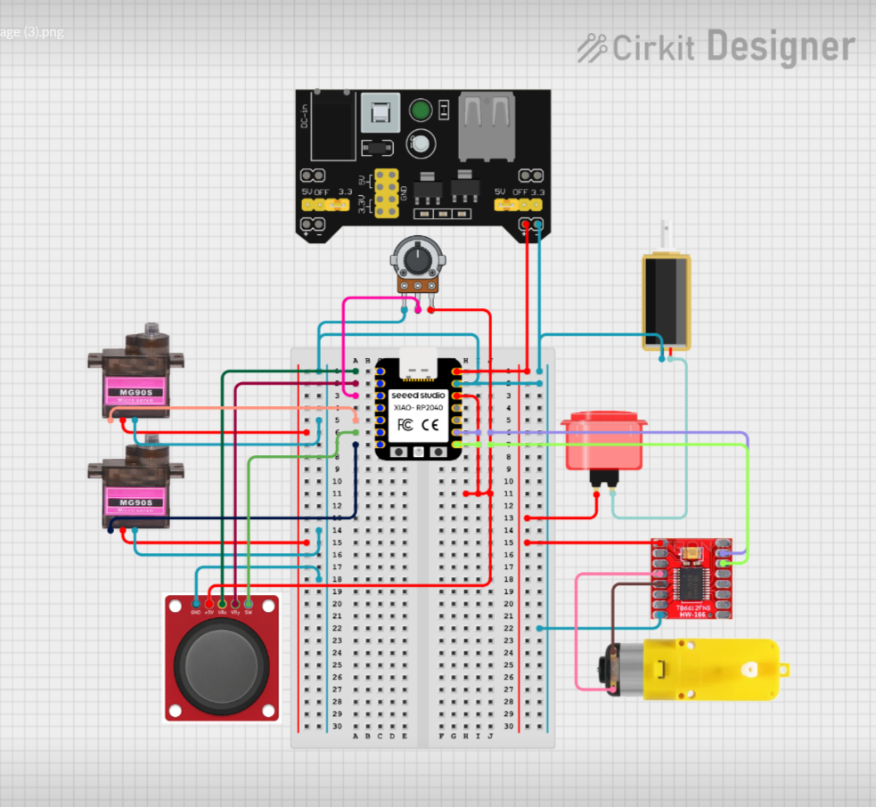
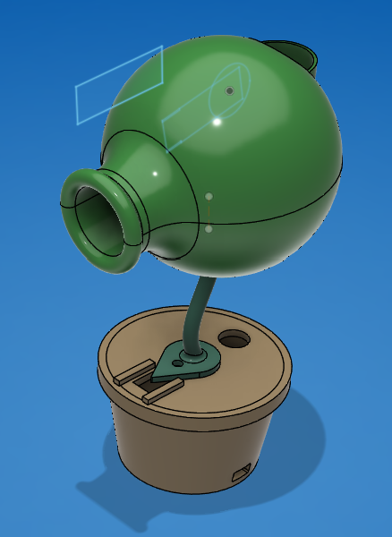

# Peashooter

by Annie L. (Canada, 18), Yuanxi C. (Michigan, 17), and Zoey C. (Canada, 17)

## For Fallout

What if the world ended...

and it was because of a Zombie apocalypse?

### Introducing the Peashooter

## Goals

Something functional: A peashooter is simple and we should be able eto get in done in what was functionally three days (Hackathon didn't properly start until the 3rd, and ends on the 6th, and both the 3rd and the 4th had trips to the outside)

## Steps

The first thing we did was ideate (obviously.)

But after that, the first thing we did was make a schematic;

In parallel, we made a CAD:

And then we tested all of our components,

Finally, we assembled everything together

## Features

- Connections are done through breadboards (there was an attempt at soldering but it turned out sad)
- The outside shell is 3D printed and then taped over and then painted (since paint doesn't really stick on PLA well)
- The ammo is green painted ping pong balls
- There is a miniture hopper that is held away from the launching mechanism by a solnoid
- A DC motor powers a 3D printed wheel which gives the balls forward spin
- Two stepper motors control the pitch and yaw of the head

## How to Use

- Use the joystick to control the pitch and the yaw of the head
- Press the joystick to start up the DC motor
- Use the potentiameter to control how quickly the DC motor is spinning
- Use the arcade button to launch!

## Inspiration

Self-evidently, the video game: Plants vs Zombies. The entire pea family have really iconic designs and have been built at several hardware hackathons. Since Fallout is apocalypse themed, we thought that it was appropriate to include something from a game that is about surviving the zombie apocalypse.
